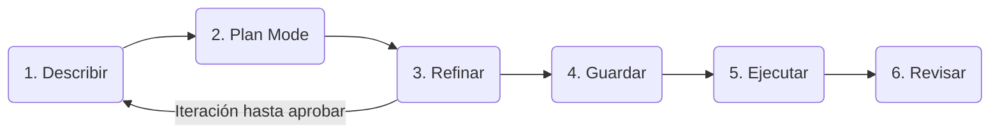

# Spec Driven Development SDD


## Diagrama


## Pasos
1. Describir (El problema no la solución)
2. Plan mode (OpenCode propone no edita)
3. Refinar (Desiciones no sugerencias)
4. Guardar (specs/auth/NN-Feature.md)
5. Ejecutar (Paso a paso)
6. Revisar (Diff por paso, comprobar )

Reglas que nadie casi sigue:
- En el paso 1 describe el problema, deja que tu LLMs proponga la solución.
- En el paso 3 da soluciones concretas  no "creo que... tal-vez seria bueno"
- En el paso 5 pide pausas entre fases del plan, revisa diffs pequeños.
- Si a la mitad del 5 quieres cambiar algo, vuelve al paso 2 no improvises

# Bloquear rama en la opcion branch
Repo>Settings>branches>add clasic branch proteccion rule
- Branch name pattern = main
- [X] Require a pull request before merging
   - [X] Require approvals (2)
- [X] Require status checks to pass before merging
- [X] Do not allow bypassing the above settings 

# Inicio

## Install Skill formato Raw
- [.agents/skills/spec-impl/SKILL.md](https://github.com/sramire3000/documentacion/blob/master/OpenCode/InstallSkillSpec/.agents/skills/spec-impl/SKILL.md)
- [.agents/skills/spec/template.md](https://github.com/sramire3000/documentacion/blob/master/OpenCode/InstallSkillSpec/.agents/skills/spec/template.md)
- [.agents/skills/spec/SKILL.md](https://github.com/sramire3000/documentacion/blob/master/OpenCode/InstallSkillSpec/.agents/skills/spec/SKILL.md)

## Install MCP Play wright

### URL
- [Playwright Test](https://playwright.dev)

### Abrir opencode
```
Necesitamos instalar el MCP de Playwright localmente
{
  "mcpServers": {
    "playwright": {
      "command": "npx",
      "args": ["@playwright/mcp@latest"]
    }
  }
}
```

### Add a .gitignore
```
# Playwright
.playwright-mcp
.playwright-mcp/*
```

### Abrir opencode
```
Puedes tomar una Screeshot?
```

## Install MCP Conext7

### URL
-[Context7](https://context7.com)

### install
```
npx ctx7 setup
```
Nota: hacer login para que genere el api key

### Example in opencode
```
Necesito que investigues cual es la manera de proteccion de rutas en Next.js usa context7 MCP
```

## Paso 01 en opencode
```
/init
```

## Adicionar al archivo "AGENTS.md"
```
## MCPs

- Playwright está configurado en `opencode.json`. Cualquier screenshot o salida relacionada con Playwright debe ir en `.playwright-mcp/` (ignorada por git).
- Usa Context7 MCP para traer la documentación actualizada del framework en vez de fiarte del entrenamiento.

## Reglas de codigo
- Usar codigo limpio, nombres, funciones, variables, ect. en ingles.
```

## Configuracion

## Ejemplos
### Creacion de spec
```
/spec Ocupamos 4 fantasmas en el juego cd pacman, cada uno debe de temer su propia forma de actuar pata qye se comporte de forma diferente y uno de ellos debe perseguir agresivamente a pacman
```

### Ejecucion
```
/spec-impl @01-test
```
