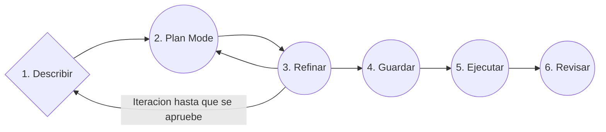

# Spec Driven Development

## Diagrama

## Pasos
1. Describir (El problema no la solución)
2. Plan mode (OpenCode propone no edita)
3. Refinar (Desiciones no sugerencias)
4. Guardar (specs/auth/NN-Feature.md)
5. Ejecutar (Paso a paso)
6. Revisar (Diff por paso, comprobar )

Reglas que nadie casi sigue:
- En el paso 1 describe el problema, deja que tu LLMs proponga la solución.
- En el paso 3 da soluciones concretas  no "creo que... tal-vez seria bueno"
- En el paso 5 pide pausas entre fases del plan, revisa diffs pequeños.
- Si a la mitad del 5 quieres cambiar algo, vuelve al paso 2 no improvises

   
