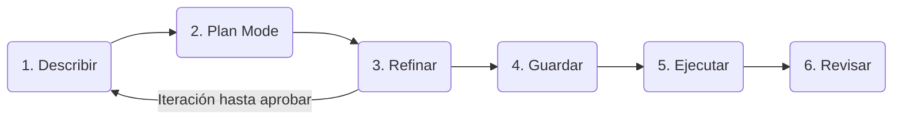

# Spec Driven Development

## Diagrama


## Configuracion

### Archivo "skills-lock.json"
```
{
  "version": 1,
  "skills": {
    "spec": {
      "source": "klerith/fernando-skills",
      "sourceType": "github",
      "skillPath": "skills/engineering/spec/SKILL.md",
      "computedHash": "8a0420eb0458ff288368bad5ffadf1e7029be9fdcbcf6abed1b0431061c09ba6"
    },
    "spec-impl": {
      "source": "klerith/fernando-skills",
      "sourceType": "github",
      "skillPath": "skills/engineering/spec-impl/SKILL.md",
      "computedHash": "ebe3edf3e5d39fc5ff4bc8e70fda783f841ed3c6ffcd436c3a520faa393db17d"
    }
  }
}
```

## Pasos
1. Describir (El problema no la solución)
2. Plan mode (OpenCode propone no edita)
3. Refinar (Desiciones no sugerencias)
4. Guardar (specs/auth/NN-Feature.md)
5. Ejecutar (Paso a paso)
6. Revisar (Diff por paso, comprobar )

Reglas que nadie casi sigue:
- En el paso 1 describe el problema, deja que tu LLMs proponga la solución.
- En el paso 3 da soluciones concretas  no "creo que... tal-vez seria bueno"
- En el paso 5 pide pausas entre fases del plan, revisa diffs pequeños.
- Si a la mitad del 5 quieres cambiar algo, vuelve al paso 2 no improvises

# Bloquear rama en la opcion branch
- Branch name pattern = main
- [X] Require a pull request before merging
   - [X] Require approvals (2)
- [X] Require status checks to pass before merging
- [X] Do not allow bypassing the above settings 

# Inicio

## Paso 01 en opencode
```
/init
```
