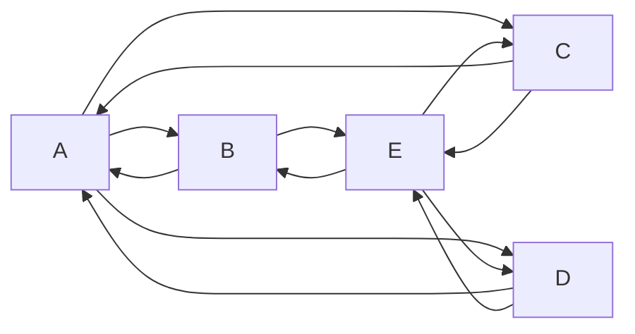
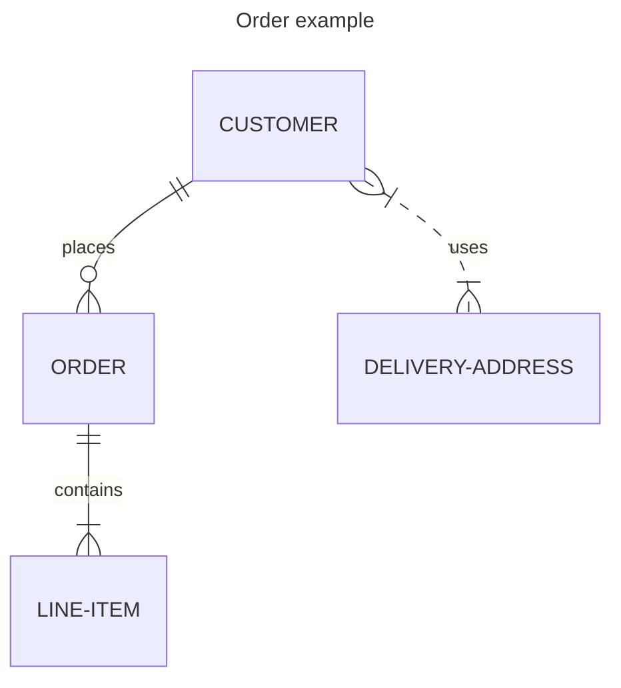
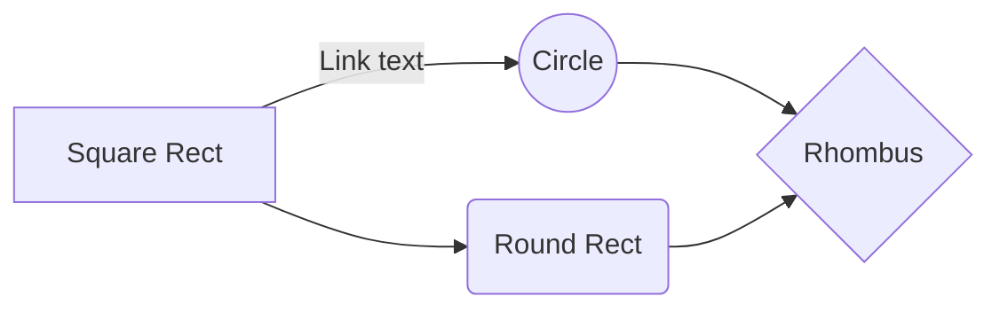

# EKEMPLOS DE DIAGRAMAS MERMAID

## Grafico

```mermaid
graph LR;
    A--> B & C & D
    B--> A & E
    C--> A & E
    D--> A & E
    E--> B & C & D
```

## Entidad relacion

```mermaid
---
title: Order example
---
erDiagram
    CUSTOMER ||--o{ ORDER : places
    ORDER ||--|{ LINE-ITEM : contains
    CUSTOMER }|..|{ DELIVERY-ADDRESS : uses
```

### Flowchart

```mermaid
graph LR
A[Square Rect] -- Link text --> B((Circle))
A --> C(Round Rect)
B --> D{Rhombus}
C --> D
```
