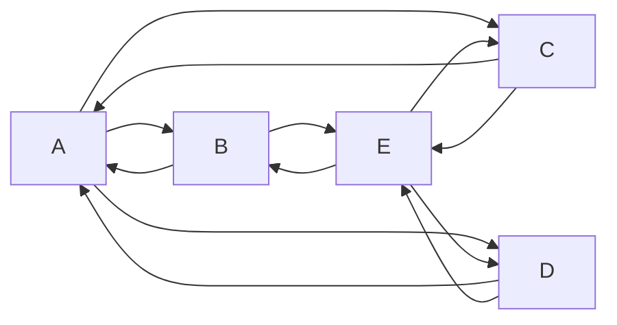
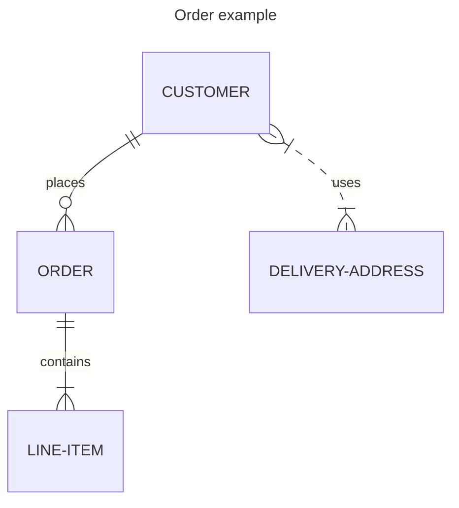
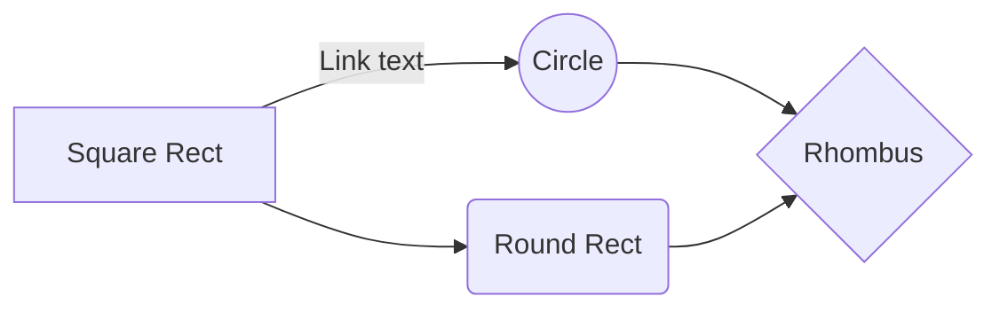
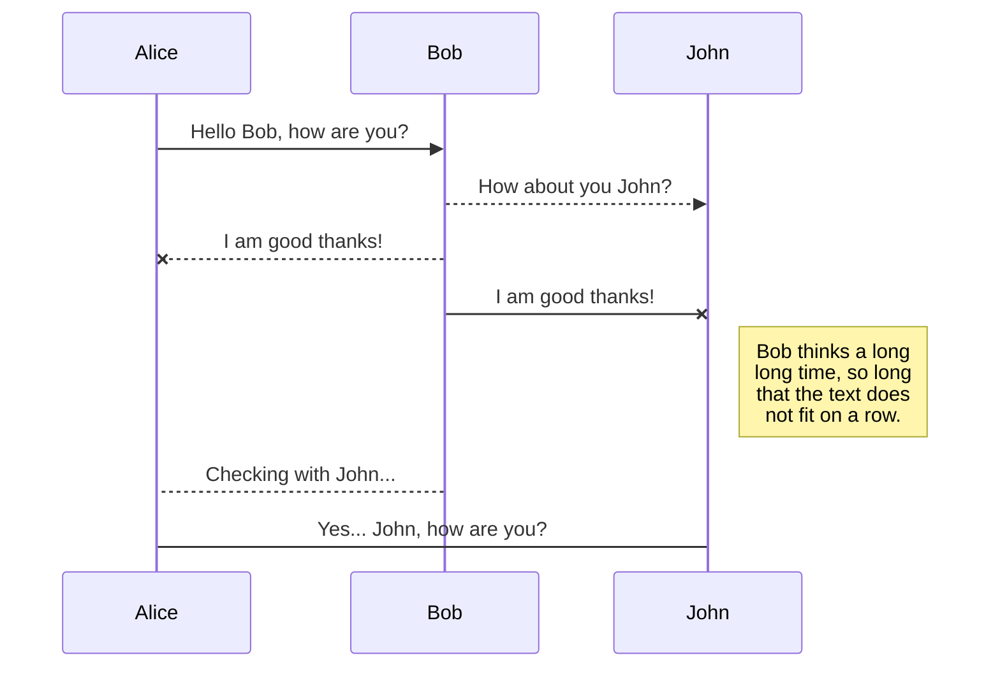
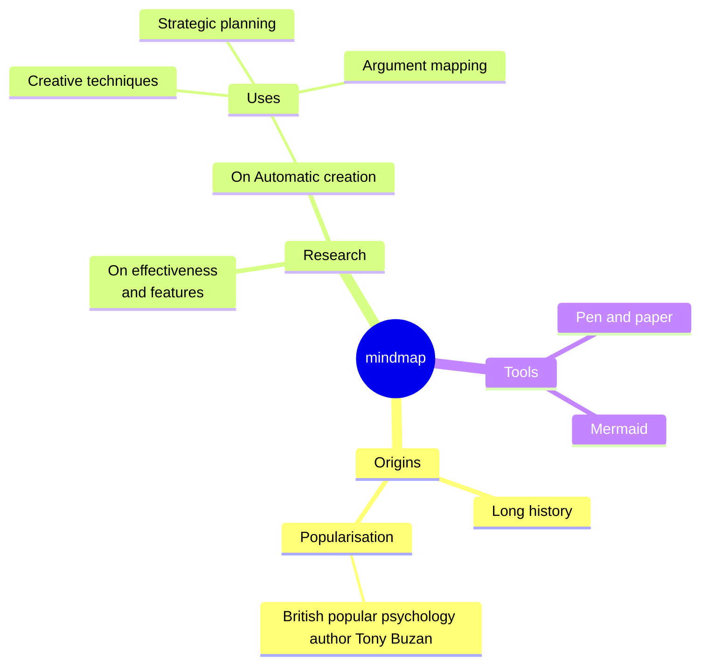
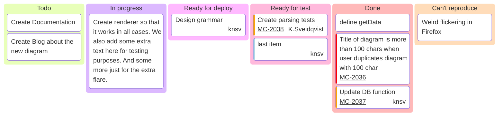

# EKEMPLOS DE DIAGRAMAS MERMAID
-ss   (https://mermaid.js.org/syntax/examples.html)


## Grafico


## Entidad relacion


## Flowchart


## Secuencia


## Mindmap


## Kanban


## Treeview
```mermaid
---
config:
    treeView:
        rowIndent: 30
        lineThickness: 3
    themeVariables:
        treeView:
            labelFontSize: '14px'
            labelColor: '#FFFFFF'
            lineColor: '#FFFFFF'
---
treeView-beta
    "app"
        "application"
            "src"
        "bootstrap"
        "domain"
            "color"
            "departamento"
        "infrastructure"
        "shared"

```
