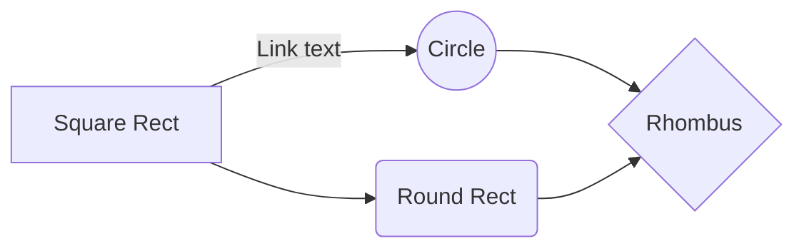

# COMANDOS DE GIT

# Download
-[Download Windows](https://git-scm.com/)
-[Stack Edit](https://stackedit.io/app#)


## Version de git
```
git --version
```

## Git config
```
git config --global user.name "John Doe"
git config --global user.email johndoe@example.com
```

## Guarda las credenciales en el gestor de windows
```
git config --global credential.helper manager
```

## Guarda las credenciales en el gestor de linnux
```
git config --global credential.helper manager-core
```


## Comandos

SmartyPants converts ASCII punctuation characters into "smart" typographic punctuation HTML entities. For example:


|             Comando            |           Descripción                |
|--------------------------------|--------------------------------------|
|git init                        | Inicaliza un repositorio             |
|git status                      | Estado del repo local                |
|git add .                       | Guarda todos los archivos repo local |
|git remote add origin "URL_GIT" | Setear el repsitorio git             |
------------------------------------------------------------------------|



